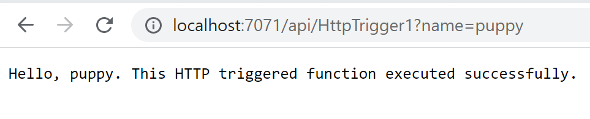

# azure-functions

## Image Upload with Serverless and Static Web Apps

[How to upload images to Blob Storage using Serverless and Static Web Apps](https://dev.to/azure/how-to-upload-images-to-blob-storage-using-serverless-and-static-web-apps-ep1)

[Github Code](https://github.com/videlalvaro/upload_image)
